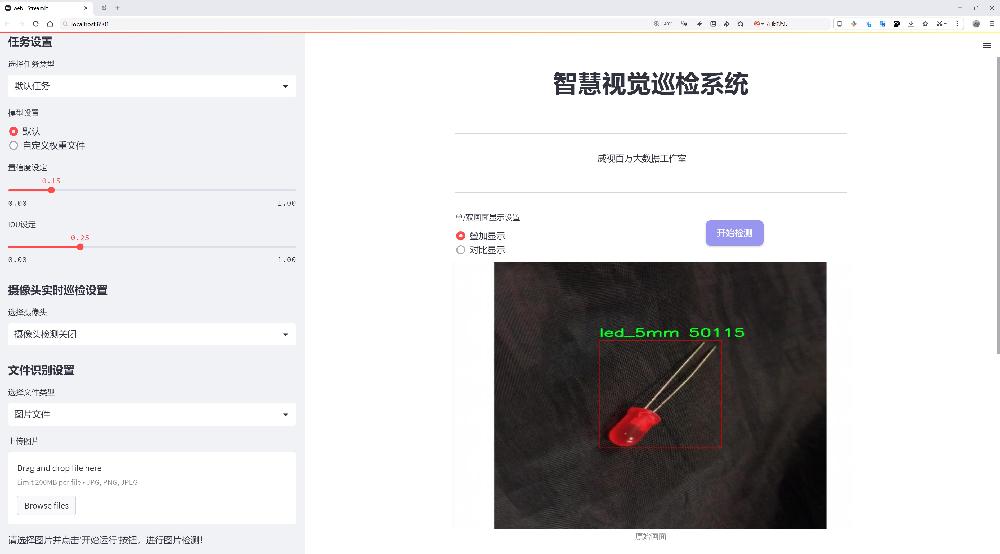

# 电子元件检测检测系统源码分享
 # [一条龙教学YOLOV8标注好的数据集一键训练_70+全套改进创新点发刊_Web前端展示]

### 1.研究背景与意义

项目参考[AAAI Association for the Advancement of Artificial Intelligence](https://gitee.com/qunshansj/projects)

项目来源[AACV Association for the Advancement of Computer Vision](https://gitee.com/qunmasj/projects)

研究背景与意义

随着电子技术的迅猛发展，电子元件的种类和数量不断增加，尤其是在消费电子、工业自动化和智能设备等领域，电子元件的应用愈发广泛。与此同时，电子元件的生产和组装过程也面临着越来越高的效率和精度要求。在这种背景下，自动化检测系统的需求日益凸显，尤其是基于深度学习的目标检测技术，因其在图像识别和处理中的优越性能，成为了电子元件检测的重要手段。

YOLO（You Only Look Once）系列模型因其高效的实时检测能力和较高的准确率，广泛应用于各类目标检测任务。YOLOv8作为该系列的最新版本，进一步提升了检测精度和速度，尤其在复杂背景和多类别目标的检测中表现出色。然而，尽管YOLOv8在目标检测领域取得了显著进展，但在特定应用场景下，仍然存在一些挑战。例如，在电子元件检测中，由于元件外观的多样性、尺寸的差异以及背景的复杂性，传统的YOLOv8模型可能无法达到理想的检测效果。因此，基于YOLOv8的改进方案，旨在提升其在电子元件检测中的性能，具有重要的研究意义。

本研究围绕改进YOLOv8模型，构建一个高效的电子元件检测系统。所使用的数据集包含1900张图像，涵盖了7类电子元件，包括3mm LED、陶瓷电容、5mm LED、可变电阻、电阻和齐纳二极管等。这些类别的选择不仅反映了当前电子元件的常见类型，也为模型的训练提供了丰富的样本基础。通过对这些图像的分析和处理，研究将重点关注如何优化YOLOv8的网络结构、损失函数和数据增强策略，以提高其在多类别目标检测中的表现。

改进YOLOv8的电子元件检测系统，不仅能够提高检测的准确性和效率，还能够为电子元件的自动化生产和质量控制提供技术支持。这对于提升电子产品的生产效率、降低人工成本、提高产品质量具有重要的实际意义。此外，随着工业4.0和智能制造的兴起，自动化检测系统的应用前景广阔，研究成果将为相关领域的技术进步提供有力的支撑。

综上所述，基于改进YOLOv8的电子元件检测系统的研究，不仅具有重要的理论价值，还具有广泛的应用前景。通过深入探索深度学习技术在电子元件检测中的应用，推动相关技术的发展，促进电子行业的智能化转型，具有重要的现实意义和深远的社会影响。

### 2.图片演示





##### 注意：由于此博客编辑较早，上面“2.图片演示”和“3.视频演示”展示的系统图片或者视频可能为老版本，新版本在老版本的基础上升级如下：（实际效果以升级的新版本为准）

  （1）适配了YOLOV8的“目标检测”模型和“实例分割”模型，通过加载相应的权重（.pt）文件即可自适应加载模型。

  （2）支持“图片识别”、“视频识别”、“摄像头实时识别”三种识别模式。

  （3）支持“图片识别”、“视频识别”、“摄像头实时识别”三种识别结果保存导出，解决手动导出（容易卡顿出现爆内存）存在的问题，识别完自动保存结果并导出到tempDir中。

  （4）支持Web前端系统中的标题、背景图等自定义修改，后面提供修改教程。

  另外本项目提供训练的数据集和训练教程,暂不提供权重文件（best.pt）,需要您按照教程进行训练后实现图片演示和Web前端界面演示的效果。

### 3.视频演示

[3.1 视频演示](https://www.bilibili.com/video/BV1Ts4aecE8N/)

### 4.数据集信息展示

##### 4.1 本项目数据集详细数据（类别数＆类别名）

nc: 7
names: ['3mm_led', 'capacitor', 'ceramic_capacitor', 'led_5mm', 'potentiometer', 'resistor', 'zener_diode']


##### 4.2 本项目数据集信息介绍

数据集信息展示

在本研究中，我们使用了名为“assignment”的数据集，以改进YOLOv8电子元件检测系统。该数据集包含七个类别的电子元件，旨在为计算机视觉任务提供丰富的训练样本，从而提高模型在实际应用中的识别精度和效率。具体而言，这七个类别包括3mm LED、陶瓷电容器、5mm LED、可变电阻器、电阻器和齐纳二极管等。这些电子元件在电子产品的设计和制造中扮演着至关重要的角色，因此准确识别和分类这些元件对于自动化检测系统的性能至关重要。

数据集的构建过程经过精心设计，确保每个类别的样本数量和质量均衡，以避免模型在训练过程中出现偏差。每个类别的样本均经过严格筛选，确保图像清晰、标注准确。数据集中的图像涵盖了不同的拍摄角度、光照条件和背景环境，旨在模拟实际应用中可能遇到的各种情况。这种多样性使得模型能够学习到更为丰富的特征，从而在实际应用中具备更强的鲁棒性。

在“assignment”数据集中，3mm LED和5mm LED作为光源元件，具有不同的尺寸和发光特性，分别用于不同的电路设计。陶瓷电容器和可变电阻器则是电路中常见的被动元件，前者用于储存电能，后者则用于调节电流。电阻器作为基础元件，在电路中用于限制电流的流动，而齐纳二极管则是一种特殊的二极管，常用于电压稳压和保护电路。这些元件的多样性为模型提供了丰富的学习材料，使其能够更好地适应不同的应用场景。

为了确保模型的有效性，我们对数据集进行了多次预处理，包括图像增强、归一化和数据扩增等。这些步骤不仅提高了数据集的多样性，还增强了模型的泛化能力。此外，我们还采用了交叉验证的方法，确保模型在不同的训练和测试集上均能保持良好的性能。这种方法能够有效避免过拟合现象，使得模型在面对新数据时依然能够保持较高的识别率。

在训练过程中，我们将“assignment”数据集与YOLOv8模型相结合，利用其先进的特征提取和目标检测能力，进行深度学习训练。通过不断迭代和优化，我们期望最终实现一个高效、准确的电子元件检测系统，能够在实际应用中快速、准确地识别和分类各种电子元件。该系统的成功实现将为电子产品的自动化检测和质量控制提供有力支持，推动电子制造行业的智能化发展。

综上所述，“assignment”数据集为改进YOLOv8电子元件检测系统提供了坚实的基础，其丰富的类别和高质量的样本为模型的训练和优化奠定了良好的基础。随着技术的不断进步，我们期待该系统在未来能够为电子元件的自动化检测提供更加高效、准确的解决方案。


### 5.全套项目环境部署视频教程（零基础手把手教学）

[5.1 环境部署教程链接（零基础手把手教学）](https://www.ixigua.com/7404473917358506534?logTag=c807d0cbc21c0ef59de5)


[5.2 安装Python虚拟环境创建和依赖库安装视频教程链接（零基础手把手教学）](https://www.ixigua.com/7404474678003106304?logTag=1f1041108cd1f708b01a)

### 6.手把手YOLOV8训练视频教程（零基础小白有手就能学会）

[6.1 手把手YOLOV8训练视频教程（零基础小白有手就能学会）](https://www.ixigua.com/7404477157818401292?logTag=d31a2dfd1983c9668658)

### 7.70+种全套YOLOV8创新点代码加载调参视频教程（一键加载写好的改进模型的配置文件）

[7.1 70+种全套YOLOV8创新点代码加载调参视频教程（一键加载写好的改进模型的配置文件）](https://www.ixigua.com/7404478314661806627?logTag=29066f8288e3f4eea3a4)

### 8.70+种全套YOLOV8创新点原理讲解（非科班也可以轻松写刊发刊，V10版本正在科研待更新）

由于篇幅限制，每个创新点的具体原理讲解就不一一展开，具体见下列网址中的创新点对应子项目的技术原理博客网址【Blog】：


[8.1 70+种全套YOLOV8创新点原理讲解链接](https://gitee.com/qunmasj/good)

### 9.系统功能展示（检测对象为举例，实际内容以本项目数据集为准）

图9.1.系统支持检测结果表格显示

  图9.2.系统支持置信度和IOU阈值手动调节

  图9.3.系统支持自定义加载权重文件best.pt(需要你通过步骤5中训练获得)

  图9.4.系统支持摄像头实时识别

  图9.5.系统支持图片识别

  图9.6.系统支持视频识别

  图9.7.系统支持识别结果文件自动保存

  图9.8.系统支持Excel导出检测结果数据


### 10.原始YOLOV8算法原理

原始YOLOv8算法原理

YOLOv8算法是当前目标检测领域的前沿技术之一，代表了YOLO系列的最新进展。该算法在设计上继承了YOLOv5的成功经验，同时进行了多项创新和优化，使其在准确性和速度上都得到了显著提升。YOLOv8的架构主要由输入层、主干网络、特征融合层和解耦头组成，构成了一个高效的目标检测系统。

在主干网络部分，YOLOv8依然采用了跨级结构（Cross Stage Partial, CSP）的思想，但在具体实现上进行了优化。特别是，YOLOv8将YOLOv5中的C3模块替换为C2f模块，这一新结构在保持检测精度的同时显著降低了模型的复杂度。C2f模块的设计灵感来源于YOLOv7的ELAN结构，通过引入更多的分支和跨层连接，增强了模型的梯度流，使得特征表示能力得到了提升。C2f模块由多个卷积模块和瓶颈结构组成，能够有效地提取和融合不同层次的特征信息。

在特征融合层，YOLOv8采用了路径聚合网络（Path Aggregation Network, PAN）结构，这一设计旨在加强不同尺度对象的特征融合能力。PAN结构通过自下而上的特征融合，结合高层特征和中层特征，再通过自上而下的横向连接，将融合后的特征输出到后端的解耦头。这种特征融合策略确保了模型在处理多尺度目标时的准确性和鲁棒性。

YOLOv8在目标检测过程中采用了Anchor-Free的思想，摒弃了传统的Anchor-Base方法。这一转变使得模型在进行目标检测时不再依赖于预定义的锚框，从而简化了模型的设计，并提高了检测速度。通过这种无锚框的设计，YOLOv8能够更灵活地适应不同的目标尺寸和形状，提高了对小目标的检测能力。

在损失函数的设计上，YOLOv8引入了新的损失策略，采用了VFLLoss作为分类损失，同时结合DFLLoss和CIoULoss来计算边界框的损失。这种新的损失计算方式使得模型在训练过程中能够更好地处理样本不平衡的问题，尤其是在目标较小或较难检测的情况下，能够有效提升模型的学习效果。此外，YOLOv8还采用了Task-Aligned的样本匹配策略，通过对正负样本的动态分配，进一步提高了训练的效率和效果。

在数据预处理方面，YOLOv8沿用了YOLOv5的策略，采用了多种数据增强技术，如马赛克增强、混合增强、空间扰动和颜色扰动等。这些增强手段不仅丰富了训练数据，还提高了模型的泛化能力，使得YOLOv8在实际应用中表现得更加稳健。

总的来说，YOLOv8算法通过对骨干网络、特征融合层、解耦头和损失函数等多个方面的优化，构建了一个高效、准确的目标检测框架。其创新的C2f模块和Anchor-Free设计，使得YOLOv8在处理复杂场景和多尺度目标时表现出色。同时，新的损失策略和样本匹配方式，进一步提升了模型的训练效率和检测精度。随着YOLOv8的推出，目标检测技术进入了一个新的阶段，为各类应用场景提供了更为强大的支持。


### 11.项目核心源码讲解（再也不用担心看不懂代码逻辑）

#### 11.1 70+种YOLOv8算法改进源码大全和调试加载训练教程（非必要）\ultralytics\nn\extra_modules\afpn.py

以下是代码中最核心的部分，并附上详细的中文注释：

```python
import torch
import torch.nn as nn
import torch.nn.functional as F
from ..modules.conv import Conv

# 定义基本的卷积块
class BasicBlock(nn.Module):
    def __init__(self, filter_in, filter_out):
        super(BasicBlock, self).__init__()
        # 定义两个卷积层
        self.conv1 = Conv(filter_in, filter_out, 3)  # 第一个卷积层，3x3卷积
        self.conv2 = Conv(filter_out, filter_out, 3, act=False)  # 第二个卷积层，3x3卷积，不使用激活函数

    def forward(self, x):
        residual = x  # 保存输入以便后续残差连接
        out = self.conv1(x)  # 通过第一个卷积层
        out = self.conv2(out)  # 通过第二个卷积层
        out += residual  # 添加残差
        return self.conv1.act(out)  # 返回激活后的输出

# 定义上采样模块
class Upsample(nn.Module):
    def __init__(self, in_channels, out_channels, scale_factor=2):
        super(Upsample, self).__init__()
        # 定义上采样的卷积层和上采样操作
        self.upsample = nn.Sequential(
            Conv(in_channels, out_channels, 1),  # 1x1卷积
            nn.Upsample(scale_factor=scale_factor, mode='bilinear')  # 双线性插值上采样
        )

    def forward(self, x):
        return self.upsample(x)  # 直接返回上采样后的结果

# 定义自适应特征融合模块（ASFF）
class ASFF_2(nn.Module):
    def __init__(self, inter_dim=512):
        super(ASFF_2, self).__init__()
        self.inter_dim = inter_dim
        compress_c = 8  # 压缩通道数

        # 定义权重卷积层
        self.weight_level_1 = Conv(self.inter_dim, compress_c, 1)
        self.weight_level_2 = Conv(self.inter_dim, compress_c, 1)
        self.weight_levels = nn.Conv2d(compress_c * 2, 2, kernel_size=1)  # 最终权重计算
        self.conv = Conv(self.inter_dim, self.inter_dim, 3)  # 特征融合后的卷积层

    def forward(self, input1, input2):
        # 计算每个输入的权重
        level_1_weight_v = self.weight_level_1(input1)
        level_2_weight_v = self.weight_level_2(input2)

        # 合并权重并计算最终权重
        levels_weight_v = torch.cat((level_1_weight_v, level_2_weight_v), 1)
        levels_weight = self.weight_levels(levels_weight_v)
        levels_weight = F.softmax(levels_weight, dim=1)  # 归一化权重

        # 融合特征
        fused_out_reduced = input1 * levels_weight[:, 0:1, :, :] + input2 * levels_weight[:, 1:2, :, :]
        out = self.conv(fused_out_reduced)  # 通过卷积层
        return out  # 返回融合后的输出

# 定义主网络结构
class AFPN_P345(nn.Module):
    def __init__(self, in_channels=[256, 512, 1024], out_channels=256, factor=4):
        super(AFPN_P345, self).__init__()
        # 定义输入通道的卷积层
        self.conv0 = Conv(in_channels[0], in_channels[0] // factor, 1)
        self.conv1 = Conv(in_channels[1], in_channels[1] // factor, 1)
        self.conv2 = Conv(in_channels[2], in_channels[2] // factor, 1)

        # 定义特征提取的主体
        self.body = BlockBody_P345([in_channels[0] // factor, in_channels[1] // factor, in_channels[2] // factor])

        # 定义输出通道的卷积层
        self.conv00 = Conv(in_channels[0] // factor, out_channels, 1)
        self.conv11 = Conv(in_channels[1] // factor, out_channels, 1)
        self.conv22 = Conv(in_channels[2] // factor, out_channels, 1)

    def forward(self, x):
        x0, x1, x2 = x  # 拆分输入
        x0 = self.conv0(x0)  # 通过第一个卷积层
        x1 = self.conv1(x1)  # 通过第二个卷积层
        x2 = self.conv2(x2)  # 通过第三个卷积层

        out0, out1, out2 = self.body([x0, x1, x2])  # 通过主体网络
        out0 = self.conv00(out0)  # 输出卷积
        out1 = self.conv11(out1)  # 输出卷积
        out2 = self.conv22(out2)  # 输出卷积
        return [out0, out1, out2]  # 返回输出

# 其他模块和类（如 AFPN_P2345, BlockBody_P2345 等）可以类似处理
```

以上代码保留了最核心的部分，包含了基本的卷积块、上采样模块、自适应特征融合模块和主网络结构，并附上了详细的中文注释。

这个文件主要实现了YOLOv8算法中的一些网络模块，特别是自适应特征金字塔网络（AFPN）和一些基础的卷积块。代码中定义了多个类，每个类负责不同的功能和结构，下面是对代码的逐部分分析。

首先，文件导入了一些必要的库，包括`torch`和`torch.nn`，以及一些自定义的模块如`Conv`和不同的块（`C2f`, `C3`, `C3Ghost`）。这些模块通常用于构建卷积神经网络的基础组件。

接下来，定义了`BasicBlock`类，这是一个基本的卷积块，包含两个卷积层和一个残差连接。它的`forward`方法实现了输入的前向传播，通过两个卷积层处理输入，并将输入与输出相加以形成残差连接。

然后，定义了一系列的上采样和下采样模块（`Upsample`, `Downsample_x2`, `Downsample_x4`, `Downsample_x8`），这些模块用于在特征图中进行空间分辨率的调整。每个模块的`forward`方法实现了相应的上采样或下采样操作。

接下来是自适应特征融合模块（`ASFF_2`, `ASFF_3`, `ASFF_4`），这些模块用于融合来自不同尺度的特征图。每个模块通过计算权重来加权不同输入特征图的贡献，并生成融合后的输出。权重的计算使用了卷积和softmax函数，以确保权重和为1。

`BlockBody_P345`和`BlockBody_P2345`类是网络的主体部分，分别处理3个和4个尺度的特征图。这些类中包含多个卷积块和自适应特征融合模块，构成了一个复杂的特征提取网络。它们的`forward`方法实现了输入特征图的处理流程，包括下采样、上采样和特征融合。

`AFPN_P345`和`AFPN_P2345`类则是自适应特征金字塔网络的实现，它们接收不同尺度的输入特征图，并通过卷积和主体模块生成输出特征图。这些类在初始化时设置了卷积层和主体模块，并在`forward`方法中定义了特征图的前向传播过程。

最后，`BlockBody_P345_Custom`和`AFPN_P345_Custom`等类允许用户自定义使用的块类型，使得网络结构更加灵活，用户可以根据需要选择不同的卷积块。

整体来看，这个文件实现了YOLOv8中用于特征提取和融合的多个重要模块，结构清晰，功能模块化，便于扩展和修改。

#### 11.2 ui.py

以下是代码中最核心的部分，并附上详细的中文注释：

```python
import sys
import subprocess

def run_script(script_path):
    """
    使用当前 Python 环境运行指定的脚本。

    Args:
        script_path (str): 要运行的脚本路径

    Returns:
        None
    """
    # 获取当前 Python 解释器的路径
    python_path = sys.executable

    # 构建运行命令，使用 streamlit 运行指定的脚本
    command = f'"{python_path}" -m streamlit run "{script_path}"'

    # 执行命令
    result = subprocess.run(command, shell=True)
    # 检查命令执行的返回码，如果不为0，表示执行出错
    if result.returncode != 0:
        print("脚本运行出错。")


# 实例化并运行应用
if __name__ == "__main__":
    # 指定要运行的脚本路径
    script_path = "web.py"  # 这里可以直接指定脚本路径

    # 调用函数运行脚本
    run_script(script_path)
```

### 代码说明：
1. **导入模块**：
   - `sys`：用于访问与 Python 解释器紧密相关的变量和函数。
   - `subprocess`：用于执行外部命令。

2. **定义 `run_script` 函数**：
   - 该函数接收一个参数 `script_path`，表示要运行的 Python 脚本的路径。
   - 使用 `sys.executable` 获取当前 Python 解释器的路径，以确保使用正确的 Python 环境。
   - 构建命令字符串，使用 `streamlit` 模块运行指定的脚本。
   - 使用 `subprocess.run` 执行构建的命令，并检查返回码以判断脚本是否成功运行。

3. **主程序块**：
   - 当脚本作为主程序运行时，指定要运行的脚本路径（此处为 `web.py`）。
   - 调用 `run_script` 函数来执行指定的脚本。

这个程序文件的主要功能是使用当前的 Python 环境来运行一个指定的脚本，具体是通过 Streamlit 框架来启动一个 Web 应用。程序的结构比较简单，主要由几个部分组成。

首先，程序导入了必要的模块，包括 `sys`、`os` 和 `subprocess`。`sys` 模块用于访问与 Python 解释器相关的变量和函数，`os` 模块提供了与操作系统交互的功能，而 `subprocess` 模块则用于创建新进程、连接到它们的输入/输出/错误管道，并获取它们的返回码。

接下来，程序从 `QtFusion.path` 模块中导入了 `abs_path` 函数，这个函数的作用是获取给定路径的绝对路径。

程序中定义了一个名为 `run_script` 的函数，该函数接受一个参数 `script_path`，表示要运行的脚本的路径。在函数内部，首先获取当前 Python 解释器的路径，并将其存储在 `python_path` 变量中。然后，构建一个命令字符串，该命令用于运行指定的脚本，命令格式为 `python -m streamlit run <script_path>`。接着，使用 `subprocess.run` 方法执行这个命令，`shell=True` 参数允许在 shell 中执行命令。

在执行命令后，程序检查返回码 `result.returncode`，如果返回码不为 0，表示脚本运行出错，程序会打印出相应的错误信息。

最后，程序通过 `if __name__ == "__main__":` 语句来判断是否是直接运行该脚本。如果是，则指定要运行的脚本路径，这里是通过 `abs_path("web.py")` 获取的，然后调用 `run_script` 函数来执行这个脚本。

总体来说，这个程序的作用是简化通过 Streamlit 启动 Web 应用的过程，确保在当前 Python 环境中正确运行指定的脚本。

#### 11.3 70+种YOLOv8算法改进源码大全和调试加载训练教程（非必要）\ultralytics\models\fastsam\utils.py

以下是经过简化和注释的核心代码部分：

```python
import torch

def adjust_bboxes_to_image_border(boxes, image_shape, threshold=20):
    """
    调整边界框，使其在接近图像边界时粘附到图像边界。

    参数:
        boxes (torch.Tensor): 边界框坐标，形状为 (n, 4)
        image_shape (tuple): 图像的高度和宽度
        threshold (int): 像素阈值，决定边界框与图像边界的距离

    返回:
        adjusted_boxes (torch.Tensor): 调整后的边界框
    """
    h, w = image_shape  # 获取图像的高度和宽度

    # 调整边界框坐标
    boxes[boxes[:, 0] < threshold, 0] = 0  # 将左边界小于阈值的框的x1设置为0
    boxes[boxes[:, 1] < threshold, 1] = 0  # 将上边界小于阈值的框的y1设置为0
    boxes[boxes[:, 2] > w - threshold, 2] = w  # 将右边界大于阈值的框的x2设置为图像宽度
    boxes[boxes[:, 3] > h - threshold, 3] = h  # 将下边界大于阈值的框的y2设置为图像高度
    return boxes  # 返回调整后的边界框

def bbox_iou(box1, boxes, iou_thres=0.9, image_shape=(640, 640), raw_output=False):
    """
    计算一个边界框与其他边界框的交并比（IoU）。

    参数:
        box1 (torch.Tensor): 单个边界框，形状为 (4, )
        boxes (torch.Tensor): 一组边界框，形状为 (n, 4)
        iou_thres (float): IoU阈值
        image_shape (tuple): 图像的高度和宽度
        raw_output (bool): 如果为True，返回原始IoU值而不是索引

    返回:
        high_iou_indices (torch.Tensor): IoU大于阈值的边界框索引
    """
    boxes = adjust_bboxes_to_image_border(boxes, image_shape)  # 调整边界框到图像边界

    # 计算交集的坐标
    x1 = torch.max(box1[0], boxes[:, 0])  # 交集左上角x坐标
    y1 = torch.max(box1[1], boxes[:, 1])  # 交集左上角y坐标
    x2 = torch.min(box1[2], boxes[:, 2])  # 交集右下角x坐标
    y2 = torch.min(box1[3], boxes[:, 3])  # 交集右下角y坐标

    # 计算交集面积
    intersection = (x2 - x1).clamp(0) * (y2 - y1).clamp(0)  # clamp(0)确保面积不为负

    # 计算各个框的面积
    box1_area = (box1[2] - box1[0]) * (box1[3] - box1[1])  # box1的面积
    box2_area = (boxes[:, 2] - boxes[:, 0]) * (boxes[:, 3] - boxes[:, 1])  # boxes的面积

    # 计算并集面积
    union = box1_area + box2_area - intersection  # 并集面积

    # 计算IoU
    iou = intersection / union  # 交并比
    if raw_output:
        return 0 if iou.numel() == 0 else iou  # 如果需要原始IoU值，直接返回

    # 返回IoU大于阈值的框的索引
    return torch.nonzero(iou > iou_thres).flatten()
```

### 代码说明：
1. **`adjust_bboxes_to_image_border` 函数**：该函数用于调整边界框的位置，使其在接近图像边界时不会超出图像的范围。通过设定一个阈值，若边界框的某一边距离图像边界小于该阈值，则将其调整到图像边界上。

2. **`bbox_iou` 函数**：该函数计算一个边界框与一组边界框之间的交并比（IoU）。首先调用 `adjust_bboxes_to_image_border` 函数调整边界框，然后计算交集和并集的面积，最后返回满足IoU阈值条件的边界框索引。可以选择返回原始的IoU值。

这个程序文件是一个用于YOLO（You Only Look Once）目标检测算法的工具模块，主要包含两个函数，分别用于调整边界框和计算交并比（IoU）。

首先，`adjust_bboxes_to_image_border`函数的作用是将给定的边界框调整到图像边界内，确保它们不会超出图像的边界。函数接收三个参数：`boxes`是一个形状为(n, 4)的张量，表示n个边界框的坐标；`image_shape`是一个元组，包含图像的高度和宽度；`threshold`是一个整数，表示距离图像边界的阈值。函数首先获取图像的高度和宽度，然后根据阈值调整边界框的坐标。如果边界框的左上角（x1, y1）距离图像边界小于阈值，则将其调整为0；如果右下角（x2, y2）超出图像边界，则将其调整为图像的宽度或高度。这种调整确保了边界框在图像内。

接下来的`bbox_iou`函数用于计算一个边界框与一组其他边界框之间的交并比。它接收多个参数：`box1`是一个形状为(4,)的张量，表示待计算的边界框；`boxes`是一个形状为(n, 4)的张量，表示其他边界框；`iou_thres`是一个浮点数，表示IoU的阈值；`image_shape`同样是图像的高度和宽度；`raw_output`是一个布尔值，指示是否返回原始的IoU值。函数首先调用`adjust_bboxes_to_image_border`来调整输入的边界框，然后计算交集的坐标，进而计算交集的面积。接着，计算两个边界框的面积，并根据交集和并集的面积计算IoU值。如果`raw_output`为真，则返回IoU值；否则，返回IoU大于阈值的边界框的索引。

总体来说，这个文件提供了边界框处理和IoU计算的基本功能，适用于YOLOv8算法中的目标检测任务。

#### 11.4 train.py

以下是经过简化和注释的核心代码部分：

```python
import random
import numpy as np
import torch.nn as nn
from ultralytics.data import build_dataloader, build_yolo_dataset
from ultralytics.engine.trainer import BaseTrainer
from ultralytics.models import yolo
from ultralytics.nn.tasks import DetectionModel
from ultralytics.utils import LOGGER, RANK
from ultralytics.utils.torch_utils import de_parallel, torch_distributed_zero_first

class DetectionTrainer(BaseTrainer):
    """
    基于检测模型的训练类，继承自BaseTrainer类。
    """

    def build_dataset(self, img_path, mode="train", batch=None):
        """
        构建YOLO数据集。

        参数:
            img_path (str): 包含图像的文件夹路径。
            mode (str): 模式，'train'表示训练模式，'val'表示验证模式。
            batch (int, optional): 批次大小，仅用于'rect'模式。默认为None。
        """
        gs = max(int(de_parallel(self.model).stride.max() if self.model else 0), 32)  # 获取模型的最大步幅
        return build_yolo_dataset(self.args, img_path, batch, self.data, mode=mode, rect=mode == "val", stride=gs)

    def get_dataloader(self, dataset_path, batch_size=16, rank=0, mode="train"):
        """构造并返回数据加载器。"""
        assert mode in ["train", "val"]  # 确保模式有效
        with torch_distributed_zero_first(rank):  # 在分布式训练中，仅初始化一次数据集
            dataset = self.build_dataset(dataset_path, mode, batch_size)
        shuffle = mode == "train"  # 训练模式下打乱数据
        workers = self.args.workers if mode == "train" else self.args.workers * 2  # 设置工作线程数
        return build_dataloader(dataset, batch_size, workers, shuffle, rank)  # 返回数据加载器

    def preprocess_batch(self, batch):
        """对图像批次进行预处理，包括缩放和转换为浮点数。"""
        batch["img"] = batch["img"].to(self.device, non_blocking=True).float() / 255  # 将图像转换为浮点数并归一化
        if self.args.multi_scale:  # 如果启用多尺度
            imgs = batch["img"]
            sz = (
                random.randrange(self.args.imgsz * 0.5, self.args.imgsz * 1.5 + self.stride)
                // self.stride
                * self.stride
            )  # 随机选择新的尺寸
            sf = sz / max(imgs.shape[2:])  # 计算缩放因子
            if sf != 1:
                ns = [
                    math.ceil(x * sf / self.stride) * self.stride for x in imgs.shape[2:]
                ]  # 计算新的形状
                imgs = nn.functional.interpolate(imgs, size=ns, mode="bilinear", align_corners=False)  # 调整图像大小
            batch["img"] = imgs
        return batch

    def get_model(self, cfg=None, weights=None, verbose=True):
        """返回YOLO检测模型。"""
        model = DetectionModel(cfg, nc=self.data["nc"], verbose=verbose and RANK == -1)  # 创建检测模型
        if weights:
            model.load(weights)  # 加载权重
        return model

    def plot_training_samples(self, batch, ni):
        """绘制带有注释的训练样本。"""
        plot_images(
            images=batch["img"],
            batch_idx=batch["batch_idx"],
            cls=batch["cls"].squeeze(-1),
            bboxes=batch["bboxes"],
            paths=batch["im_file"],
            fname=self.save_dir / f"train_batch{ni}.jpg",
            on_plot=self.on_plot,
        )

    def plot_metrics(self):
        """从CSV文件中绘制指标。"""
        plot_results(file=self.csv, on_plot=self.on_plot)  # 保存结果图
```

### 代码说明：
1. **DetectionTrainer类**：该类用于处理YOLO模型的训练过程，继承自`BaseTrainer`。
2. **build_dataset方法**：构建YOLO数据集，支持训练和验证模式，返回构建好的数据集。
3. **get_dataloader方法**：构造数据加载器，确保在分布式训练中只初始化一次数据集，并根据模式设置是否打乱数据。
4. **preprocess_batch方法**：对输入的图像批次进行预处理，包括归一化和多尺度调整。
5. **get_model方法**：创建并返回YOLO检测模型，支持加载预训练权重。
6. **plot_training_samples方法**：绘制训练样本及其注释，便于可视化训练过程。
7. **plot_metrics方法**：从CSV文件中提取并绘制训练指标，帮助监控训练效果。

这个程序文件 `train.py` 是一个用于训练目标检测模型的脚本，主要基于 YOLO（You Only Look Once）模型。文件中包含了一个名为 `DetectionTrainer` 的类，该类继承自 `BaseTrainer`，用于实现训练过程中的各种功能。

在类的构造中，`DetectionTrainer` 提供了多个方法来构建数据集、获取数据加载器、预处理图像批次、设置模型属性、获取模型、获取验证器、记录损失、显示训练进度、绘制训练样本和绘制训练指标等。

`build_dataset` 方法用于构建 YOLO 数据集，接收图像路径、模式（训练或验证）和批次大小作为参数。它使用 `build_yolo_dataset` 函数来创建数据集，并根据模型的步幅进行调整。

`get_dataloader` 方法用于构建并返回数据加载器。它会根据模式（训练或验证）来决定是否打乱数据，并设置工作线程的数量。使用 `torch_distributed_zero_first` 确保在分布式训练中只初始化一次数据集。

`preprocess_batch` 方法负责对图像批次进行预处理，包括将图像缩放到适当的大小并转换为浮点数格式。它还支持多尺度训练，通过随机选择图像大小来增强模型的鲁棒性。

`set_model_attributes` 方法用于设置模型的属性，包括类别数量和类别名称等。它确保模型的配置与数据集相匹配。

`get_model` 方法返回一个 YOLO 检测模型，支持加载预训练权重。

`get_validator` 方法返回一个用于验证 YOLO 模型的验证器，记录损失名称以便后续使用。

`label_loss_items` 方法用于返回带有标签的训练损失项字典，便于监控训练过程中的损失情况。

`progress_string` 方法返回一个格式化的字符串，显示训练进度，包括当前的 epoch、GPU 内存使用情况、损失值、实例数量和图像大小等信息。

`plot_training_samples` 方法用于绘制训练样本及其注释，便于可视化训练过程中的数据。

`plot_metrics` 方法从 CSV 文件中绘制训练指标，以便分析模型的性能。

最后，`plot_training_labels` 方法创建一个带标签的训练图，显示训练数据集中所有的边界框和类别信息，帮助理解模型的训练效果。

总体来说，这个文件实现了 YOLO 模型训练的核心功能，涵盖了数据处理、模型训练、损失监控和结果可视化等多个方面，适合用于目标检测任务的训练。

#### 11.5 70+种YOLOv8算法改进源码大全和调试加载训练教程（非必要）\ultralytics\utils\atss.py

以下是经过简化和注释的核心代码部分，主要保留了生成锚框和计算IoU的功能。

```python
import torch
import torch.nn as nn
import torch.nn.functional as F

def generate_anchors(feats, fpn_strides, grid_cell_size=5.0, grid_cell_offset=0.5, device='cpu', is_eval=False, mode='af'):
    '''根据特征生成锚框。'''
    anchors = []  # 存储锚框
    anchor_points = []  # 存储锚点
    stride_tensor = []  # 存储步幅
    num_anchors_list = []  # 存储每层的锚框数量

    assert feats is not None  # 确保特征不为空

    # 评估模式
    if is_eval:
        for i, stride in enumerate(fpn_strides):
            _, _, h, w = feats[i].shape  # 获取特征图的高度和宽度
            shift_x = torch.arange(end=w, device=device) + grid_cell_offset  # 计算x方向的偏移
            shift_y = torch.arange(end=h, device=device) + grid_cell_offset  # 计算y方向的偏移
            shift_y, shift_x = torch.meshgrid(shift_y, shift_x, indexing='ij')  # 创建网格
            anchor_point = torch.stack([shift_x, shift_y], axis=-1).to(torch.float)  # 生成锚点

            if mode == 'af':  # anchor-free模式
                anchor_points.append(anchor_point.reshape([-1, 2]))  # 将锚点展平
                stride_tensor.append(torch.full((h * w, 1), stride, dtype=torch.float, device=device))  # 填充步幅
            elif mode == 'ab':  # anchor-based模式
                anchor_points.append(anchor_point.reshape([-1, 2]).repeat(3, 1))  # 重复锚点
                stride_tensor.append(torch.full((h * w, 1), stride, dtype=torch.float, device=device).repeat(3, 1))  # 重复步幅

        anchor_points = torch.cat(anchor_points)  # 合并锚点
        stride_tensor = torch.cat(stride_tensor)  # 合并步幅
        return anchor_points, stride_tensor  # 返回锚点和步幅

    # 训练模式
    else:
        for i, stride in enumerate(fpn_strides):
            _, _, h, w = feats[i].shape  # 获取特征图的高度和宽度
            cell_half_size = grid_cell_size * stride * 0.5  # 计算锚框的一半大小
            shift_x = (torch.arange(end=w, device=device) + grid_cell_offset) * stride  # 计算x方向的偏移
            shift_y = (torch.arange(end=h, device=device) + grid_cell_offset) * stride  # 计算y方向的偏移
            shift_y, shift_x = torch.meshgrid(shift_y, shift_x, indexing='ij')  # 创建网格

            # 生成锚框
            anchor = torch.stack(
                [
                    shift_x - cell_half_size, shift_y - cell_half_size,
                    shift_x + cell_half_size, shift_y + cell_half_size
                ],
                axis=-1).clone().to(feats[0].dtype)

            anchor_point = torch.stack([shift_x, shift_y], axis=-1).clone().to(feats[0].dtype)  # 生成锚点

            if mode == 'af':  # anchor-free模式
                anchors.append(anchor.reshape([-1, 4]))  # 将锚框展平
                anchor_points.append(anchor_point.reshape([-1, 2]))  # 将锚点展平
            elif mode == 'ab':  # anchor-based模式
                anchors.append(anchor.reshape([-1, 4]).repeat(3, 1))  # 重复锚框
                anchor_points.append(anchor_point.reshape([-1, 2]).repeat(3, 1))  # 重复锚点

            num_anchors_list.append(len(anchors[-1]))  # 记录锚框数量
            stride_tensor.append(torch.full([num_anchors_list[-1], 1], stride, dtype=feats[0].dtype))  # 填充步幅

        anchors = torch.cat(anchors)  # 合并锚框
        anchor_points = torch.cat(anchor_points).to(device)  # 合并锚点并转移到指定设备
        stride_tensor = torch.cat(stride_tensor).to(device)  # 合并步幅并转移到指定设备
        return anchors, anchor_points, num_anchors_list, stride_tensor  # 返回锚框、锚点、锚框数量和步幅

def bbox_overlaps(bboxes1, bboxes2, mode='iou', is_aligned=False, eps=1e-6):
    """计算两个bbox集合之间的重叠区域。

    Args:
        bboxes1 (Tensor): 形状为(M, 4)的边界框，格式为<x1, y1, x2, y2>。
        bboxes2 (Tensor): 形状为(N, 4)的边界框，格式为<x1, y1, x2, y2>。
        mode (str): "iou"（交并比）、"iof"（前景交集）或"giou"（广义交并比）。
        is_aligned (bool): 如果为True，则m和n必须相等。
        eps (float): 为了数值稳定性而添加到分母的值。

    Returns:
        Tensor: 形状为(m, n)的重叠区域。
    """
    assert mode in ['iou', 'iof', 'giou'], f'不支持的模式 {mode}'
    assert (bboxes1.size(-1) == 4 or bboxes1.size(0) == 0)
    assert (bboxes2.size(-1) == 4 or bboxes2.size(0) == 0)

    # 获取边界框的数量
    rows = bboxes1.size(-2)
    cols = bboxes2.size(-2)
    if is_aligned:
        assert rows == cols  # 如果对齐，行数必须相等

    if rows * cols == 0:  # 如果没有边界框
        return bboxes1.new_zeros((rows, cols)) if not is_aligned else bboxes1.new_zeros((rows,))

    # 计算面积
    area1 = (bboxes1[..., 2] - bboxes1[..., 0]) * (bboxes1[..., 3] - bboxes1[..., 1])
    area2 = (bboxes2[..., 2] - bboxes2[..., 0]) * (bboxes2[..., 3] - bboxes2[..., 1])

    # 计算重叠区域
    lt = torch.max(bboxes1[..., :2], bboxes2[..., :2])  # 左上角
    rb = torch.min(bboxes1[..., 2:], bboxes2[..., 2:])  # 右下角
    wh = (rb - lt).clamp(min=0)  # 宽高
    overlap = wh[..., 0] * wh[..., 1]  # 重叠面积

    # 计算联合面积
    union = area1 + area2 - overlap + eps  # 避免除以零
    ious = overlap / union  # 计算IoU

    return ious  # 返回IoU
```

### 代码说明
1. **生成锚框 (`generate_anchors`)**:
   - 根据输入特征图的大小和步幅生成锚框。
   - 支持两种模式：`anchor-free` 和 `anchor-based`。
   - 返回生成的锚框、锚点、锚框数量和步幅。

2. **计算边界框重叠 (`bbox_overlaps`)**:
   - 计算两个边界框集合之间的重叠区域（IoU）。
   - 支持不同的计算模式（IoU、IoF、GIoU）。
   - 返回重叠区域的计算结果。 

这些功能是目标检测中非常核心的部分，生成锚框和计算IoU是训练和评估模型的基础。

这个程序文件主要实现了与YOLOv8目标检测算法相关的一些功能，特别是自适应训练样本选择（ATSS）分配器。文件中包含多个函数和一个类，具体功能如下：

首先，`generate_anchors`函数用于生成锚框（anchors），根据输入特征图的大小和不同的步幅（fpn_strides）计算锚框的位置。该函数支持两种模式：锚框自由模式（anchor-free）和锚框基础模式（anchor-based）。在评估模式下，它会生成锚点并返回锚点和步幅张量；在训练模式下，它会生成具体的锚框坐标。

接下来，`fp16_clamp`函数用于对浮点16（FP16）张量进行限制，以避免数值溢出。`bbox_overlaps`函数则计算两个边界框集合之间的重叠程度，支持不同的重叠计算模式（如IoU、IoF和GIoU），并提供了对齐和非对齐的计算方式。

`cast_tensor_type`和`iou2d_calculator`函数用于处理张量类型和计算2D边界框的重叠情况。`dist_calculator`函数计算真实边界框（gt_bboxes）与锚框之间的中心距离，而`iou_calculator`函数则用于批量计算IoU。

最后，`ATSSAssigner`类是文件的核心部分，实现了自适应训练样本选择的逻辑。它的`forward`方法接收锚框、真实边界框和其他相关信息，计算重叠和距离，并选择合适的锚框进行分配。该方法还考虑了正负样本的选择，生成目标标签、目标边界框和目标分数。类中还包含了一些辅助方法，用于选择候选框、计算阈值和获取目标。

整体来看，这个文件为YOLOv8算法提供了重要的基础功能，特别是在目标检测中锚框的生成和分配方面，能够有效提高模型的性能和训练效率。

#### 11.6 70+种YOLOv8算法改进源码大全和调试加载训练教程（非必要）\ultralytics\utils\callbacks\hub.py

以下是代码中最核心的部分，并附上详细的中文注释：

```python
import json
from time import time
from ultralytics.hub.utils import HUB_WEB_ROOT, PREFIX, events
from ultralytics.utils import LOGGER, SETTINGS

def on_fit_epoch_end(trainer):
    """在每个训练周期结束时上传训练进度指标。"""
    session = getattr(trainer, 'hub_session', None)  # 获取训练器的会话信息
    if session:
        # 在验证结束后上传指标
        all_plots = {**trainer.label_loss_items(trainer.tloss, prefix='train'), **trainer.metrics}  # 收集训练损失和指标
        if trainer.epoch == 0:
            from ultralytics.utils.torch_utils import model_info_for_loggers
            all_plots = {**all_plots, **model_info_for_loggers(trainer)}  # 如果是第一个周期，添加模型信息
        session.metrics_queue[trainer.epoch] = json.dumps(all_plots)  # 将指标数据存入队列
        if time() - session.timers['metrics'] > session.rate_limits['metrics']:  # 检查是否超过上传限制
            session.upload_metrics()  # 上传指标
            session.timers['metrics'] = time()  # 重置计时器
            session.metrics_queue = {}  # 重置队列

def on_model_save(trainer):
    """在模型保存时上传检查点，并遵循速率限制。"""
    session = getattr(trainer, 'hub_session', None)  # 获取训练器的会话信息
    if session:
        is_best = trainer.best_fitness == trainer.fitness  # 判断当前模型是否是最佳模型
        if time() - session.timers['ckpt'] > session.rate_limits['ckpt']:  # 检查是否超过上传限制
            LOGGER.info(f'{PREFIX}Uploading checkpoint {HUB_WEB_ROOT}/models/{session.model_id}')  # 记录上传信息
            session.upload_model(trainer.epoch, trainer.last, is_best)  # 上传模型检查点
            session.timers['ckpt'] = time()  # 重置计时器

def on_train_end(trainer):
    """在训练结束时上传最终模型和指标到Ultralytics HUB。"""
    session = getattr(trainer, 'hub_session', None)  # 获取训练器的会话信息
    if session:
        LOGGER.info(f'{PREFIX}Syncing final model...')  # 记录同步信息
        session.upload_model(trainer.epoch, trainer.best, map=trainer.metrics.get('metrics/mAP50-95(B)', 0), final=True)  # 上传最终模型
        session.alive = False  # 停止心跳
        LOGGER.info(f'{PREFIX}Done ✅\n'
                    f'{PREFIX}View model at {HUB_WEB_ROOT}/models/{session.model_id} 🚀')  # 记录完成信息

# 定义回调函数字典，根据设置决定是否启用
callbacks = {
    'on_fit_epoch_end': on_fit_epoch_end,
    'on_model_save': on_model_save,
    'on_train_end': on_train_end,
} if SETTINGS['hub'] is True else {}  # 验证是否启用
```

### 代码说明：
1. **导入模块**：导入所需的模块，包括 `json` 和 `time`，以及来自 `ultralytics` 的工具。
2. **`on_fit_epoch_end` 函数**：在每个训练周期结束时调用，负责收集和上传训练指标。
   - 收集训练损失和其他指标，并将其存入会话的指标队列。
   - 检查上传时间间隔，若超过限制则上传指标并重置计时器。
3. **`on_model_save` 函数**：在模型保存时调用，负责上传模型检查点。
   - 判断当前模型是否是最佳模型，并在满足条件时上传。
4. **`on_train_end` 函数**：在训练结束时调用，负责上传最终模型和指标。
   - 记录同步信息并上传最终模型，停止心跳信号。
5. **回调函数字典**：根据设置决定是否启用相关的回调函数，以便在训练过程中进行相应的操作。

这个程序文件是一个用于YOLO（You Only Look Once）算法的回调函数模块，主要用于在训练过程中与Ultralytics HUB进行交互。代码中定义了一系列回调函数，这些函数在特定的训练阶段被调用，以便记录训练进度、上传模型和指标等。

首先，`on_pretrain_routine_end`函数在预训练过程结束时被调用。它的主要作用是记录模型的访问信息，并启动一个计时器以限制上传速率。如果训练器有一个`hub_session`属性，函数会输出模型的链接，并初始化计时器。

接下来，`on_fit_epoch_end`函数在每个训练周期结束时被调用。它会收集训练损失和其他指标，并将这些信息上传到Ultralytics HUB。特别地，如果是第一个周期，它还会收集模型的额外信息。函数会检查上传的时间间隔，以确保不超过速率限制。

`on_model_save`函数负责在训练过程中保存模型的检查点。它会检查当前模型是否是最佳模型，并在符合速率限制的情况下上传检查点。

`on_train_end`函数在训练结束时被调用，负责上传最终的模型和训练指标。它会输出同步模型的日志，并在上传完成后停止心跳信号。

此外，还有一些其他的回调函数，如`on_train_start`、`on_val_start`、`on_predict_start`和`on_export_start`，这些函数在训练、验证、预测和导出开始时调用，用于执行相关事件。

最后，所有这些回调函数被组织在一个字典中，只有在设置中启用了hub功能时，这个字典才会被创建。这样做的目的是为了确保在不需要与Ultralytics HUB交互时，程序不会执行这些回调，从而提高效率。

### 12.系统整体结构（节选）

### 整体功能和构架概括

该项目是一个基于YOLOv8目标检测算法的实现，包含了多个模块和工具，旨在提供完整的训练、推理和模型管理功能。整体架构包括数据处理、模型构建、训练过程、评估、可视化以及与Ultralytics HUB的交互等功能。每个模块的设计都遵循了功能分离的原则，使得代码结构清晰且易于维护和扩展。

- **数据处理**：负责数据集的加载、增强和预处理。
- **模型构建**：定义了YOLOv8模型的各个组件，包括特征提取、损失计算等。
- **训练过程**：实现了训练循环、损失记录、模型保存等功能。
- **推理与评估**：提供了模型推理和性能评估的工具。
- **回调机制**：与Ultralytics HUB进行交互，支持模型的上传和指标的记录。

### 文件功能整理表

| 文件路径                                                                                     | 功能描述                                                                                     |
|----------------------------------------------------------------------------------------------|----------------------------------------------------------------------------------------------|
| `ultralytics/nn/extra_modules/afpn.py`                                                      | 实现自适应特征金字塔网络（AFPN）及其相关模块，用于特征提取和融合。                                   |
| `ui.py`                                                                                     | 启动Streamlit Web应用，简化模型训练和推理的过程。                                             |
| `ultralytics/models/fastsam/utils.py`                                                      | 提供边界框处理和IoU计算的工具函数，支持目标检测任务。                                           |
| `train.py`                                                                                  | 定义训练过程，包括数据集构建、模型训练、损失监控和结果可视化等功能。                               |
| `ultralytics/utils/atss.py`                                                                 | 实现自适应训练样本选择（ATSS）逻辑，处理锚框生成和分配。                                        |
| `ultralytics/utils/callbacks/hub.py`                                                       | 定义与Ultralytics HUB交互的回调函数，支持模型上传和训练指标记录。                                 |
| `ultralytics/data/annotator.py`                                                             | 提供注释工具，用于可视化数据集中的标注信息。                                                    |
| `ultralytics/assets/utils/__init__.py`                                                     | 初始化资产工具模块，可能包含一些通用的工具函数。                                               |
| `ultralytics/data/augment.py`                                                               | 实现数据增强功能，增强训练数据集的多样性，提高模型的鲁棒性。                                     |
| `ultralytics/nn/__init__.py`                                                                | 初始化神经网络模块，可能包含模型的基本组件和工具。                                             |
| `ultralytics/models/yolo/detect/predict.py`                                                | 实现YOLO模型的推理功能，处理输入图像并生成预测结果。                                            |
| `ultralytics/nn/__init__.py`                                                                | 初始化神经网络模块，组织和导出网络相关的类和函数。                                             |
| `ultralytics/models/utils/__init__.py`                                                     | 初始化模型工具模块，可能包含一些通用的模型处理函数。                                           |

这个表格提供了每个文件的功能概述，帮助理解整个项目的结构和各个模块的作用。

注意：由于此博客编辑较早，上面“11.项目核心源码讲解（再也不用担心看不懂代码逻辑）”中部分代码可能会优化升级，仅供参考学习，完整“训练源码”、“Web前端界面”和“70+种创新点源码”以“13.完整训练+Web前端界面+70+种创新点源码、数据集获取”的内容为准。

### 13.完整训练+Web前端界面+70+种创新点源码、数据集获取


# [下载链接：https://mbd.pub/o/bread/ZpuTmZxt](https://mbd.pub/o/bread/ZpuTmZxt)